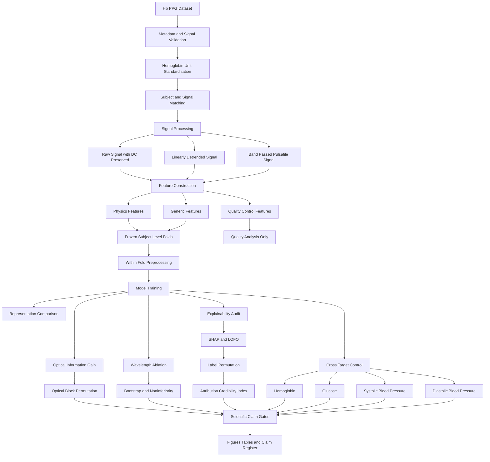
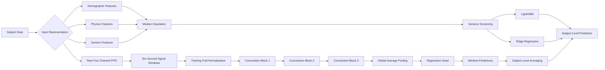

# Optical or Demographic?

## A Confound Controlled and Null Calibrated Audit of Reflectance PPG for Hemoglobin Estimation

This repository contains the complete notebook and manuscript materials for a computational study of noninvasive Hemoglobin estimation using four wavelength reflectance photoplethysmography, or PPG.

The study investigates:

1. Whether optical PPG features add useful Hemoglobin information beyond demographics.
2. Whether SHAP importance can be trusted for feature or wavelength selection.

## Repository Contents

- `Hb_PPG_OIG_NCAA_Study.ipynb`: complete research notebook
- `Overleaf_ML_Paper.zip`: IEEE manuscript source and figures
- `README.md`: project overview

## Main Contributions

- **Optical Information Gain:** measures whether optical features add information beyond demographics.
- **Optical permutation test:** compares the real optical contribution with randomly aligned optical features.
- **Representation comparison:** evaluates physics features, generic waveform features, combined features, and raw signal learning.
- **Exhaustive wavelength ablation:** retrains every nonempty combination of the four wavelengths.
- **Null Calibrated Attribution Audit:** compares SHAP with direct feature removal and label permuted models.
- **Attribution Credibility Index:** measures whether explanation agreement is better than a no information baseline.
- **Photon budget analysis:** checks whether wavelength importance follows channel signal quality.
- **Cross target control:** applies the optical pipeline to glucose and blood pressure.

## Complete Research Pipeline

## Model Architecture

## Dataset Details

The study uses the public **Hb PPG dataset**, officially titled:

**A Four Wavelength Photoplethysmography Dataset for Noninvasive Hemoglobin Assessment**

### Dataset Summary

- 252 adult subjects
- Age range: 21 to 90 years
- Four wavelength fingertip reflectance PPG
- Wavelengths: 660, 730, 850, and 940 nm
- Sampling frequency: 200 Hz
- Synchronous optical acquisition
- Reference Hemoglobin measured from venous blood
- Demographic information including sex, age, height, and weight
- Fasting glucose measurements
- Systolic and diastolic blood pressure measurements

### Official Dataset Access

https://figshare.com/articles/dataset/Hemoglobin_detection_based_on_four-wavelength_PPG_signal_zip/22256143

### Dataset DOI

https://doi.org/10.6084/m9.figshare.22256143

### Associated Dataset Publication

L. Chen et al., “A Four Wavelength Photoplethysmography Dataset for Noninvasive Hemoglobin Assessment,” *Scientific Data*, 2026.

https://doi.org/10.1038/s41597-026-06945-6

### Dataset Use

The dataset is **not redistributed in this repository**. Users should download it from the official Figshare source and cite the original dataset publication.

## Models

### Mean Reference

Predicts the training fold mean and provides the simplest reference.

### Ridge Regression

Provides a regularised linear baseline for the engineered optical features.

### LightGBM

Acts as the primary tabular model for demographic, optical, and combined feature sets. It can model nonlinear relationships and interactions in a modest subject level dataset.

### One Dimensional CNN

Learns directly from raw four channel PPG windows. Training fold channel statistics are used for normalisation so that DC information is preserved.

## Feature Architecture

### Physics Features

- Raw DC level
- Logarithmic DC
- Pulsatile AC measurements
- AC to DC ratios
- Perfusion related quantities
- Cross wavelength ratios
- Logarithmic ratio quantities

### Generic Features

- Waveform statistics
- Signal dispersion
- Skewness and kurtosis
- Spectral power
- Dominant frequency
- Spectral entropy
- Pulse rate
- Interbeat variability
- Pulse morphology measurements

### Quality Control Features

- Finite sample ratio
- Recording duration
- Clipping fraction
- Detected peak count
- Signal to noise ratio

Quality control features are used for signal assessment and photon budget analysis but are excluded from predictive feature matrices.

## Validation Design

The notebook uses frozen subject level cross validation. The same subject folds are reused across:

- Model types
- Feature representations
- Wavelength subsets
- Demographic and optical comparisons
- Permutation tests
- Cross target experiments

Imputation, variance screening, scaling, parameter selection, and model fitting occur inside the training partitions. Predictions are generated only for held out subjects.

## Explainability Audit

SHAP explains how a fitted model distributes importance among its available features. SHAP does not directly establish physiological mechanism or physical channel redundancy.

The notebook compares SHAP with leave one feature out retraining. The complete comparison is repeated using models trained on permuted Hemoglobin labels. This tests whether the observed explanation is more credible than an explanation produced by a model with no valid Hemoglobin information.

## Reproducibility

The notebook includes:

- Smoke and final execution modes
- Fixed random seeds
- Frozen subject folds
- Schema tagged feature caching
- DC preservation checks
- Subject level out of fold predictions
- Bootstrap confidence intervals
- Permutation based null distributions
- Structural integrity checks
- Scientific claim gates
- Automatic figure and table export
- Final claim register

A failed scientific gate does not mean that notebook execution failed. It means that the corresponding scientific claim is not supported.

## Running the Study

1. Download the dataset from the official Figshare source.
2. Extract the dataset locally.
3. Open `Hb_PPG_OIG_NCAA_Study.ipynb`.
4. Update the dataset and output paths.
5. Run the notebook in smoke test mode.
6. Confirm that all structural checks pass.
7. Enable final mode.
8. Restart the notebook kernel.
9. Run all cells from the beginning.
10. Use the final claim register when interpreting the study.

## Research Scope

This repository contains a computational and methodological study. It does not claim:

- A clinically validated Hemoglobin device
- Replacement of laboratory blood testing
- Reliable anemia diagnosis
- Proven physical wavelength redundancy
- Causal interpretation of SHAP values
- External clinical generalisation

## Author

**Fahad Ibne Firoz**  
Department of Computer Science  
American International University Bangladesh  
Dhaka, Bangladesh

## Notice

This repository is intended for research and educational purposes only. The models and outputs are not intended for clinical diagnosis, medical screening, or treatment decisions.
